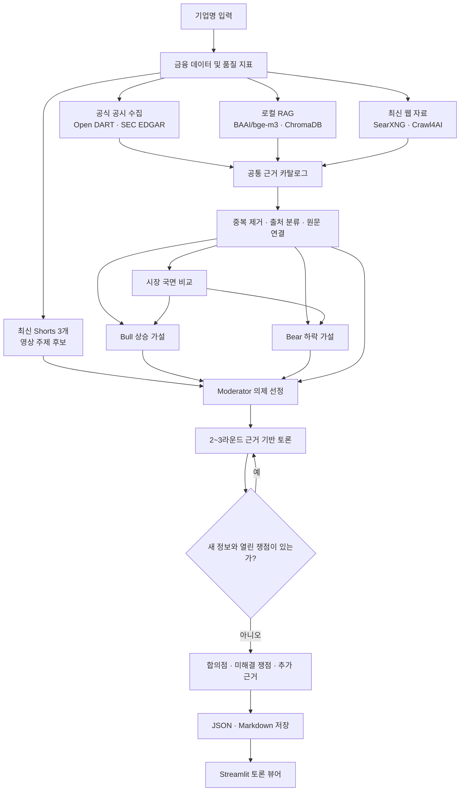

<div align="center">

# MarketCouncil

### 근거를 수집하고, 경쟁 가설을 토론시키고, 판단의 변화를 추적하는 투자 분석 시스템

MarketCouncil은 하나의 LLM에게 종목 추천을 요청하는 대신 금융 데이터, 공식 공시, 리서치 문서, 최신 웹 자료와 영상 주장을 공통 근거로 구성하고 **Bull과 Bear가 같은 사실을 두고 경쟁하도록 만드는 프로젝트**입니다.

> 현재 개발 초점: **투자 토론의 의제 선정, 근거 연결, 반복 방지와 종료 조건 고도화**

</div>

---

## 만들고 싶은 것

투자 판단에서 중요한 것은 미래를 정확히 맞히는 척하는 것이 아니라 다음 질문을 반복해서 검증하는 일이라고 생각합니다.

- 지금 확인된 사실은 무엇인가?
- 시장은 이미 무엇을 기대하고 있는가?
- 상승 가설과 하락 가설은 어디에서 충돌하는가?
- 어떤 근거가 가설을 강화하거나 약화하는가?
- 이전 판단과 비교해 무엇이 달라졌는가?

MarketCouncil의 목표는 여러 분석 결과를 단순히 나열하는 것이 아닙니다. **출처가 있는 주장만 토론에 올리고, 반대 근거와 데이터 공백을 함께 보여주며, 최종 판단은 사용자가 내릴 수 있는 분석 환경**을 만드는 것입니다.

자동매매, 수익 보장, 정답처럼 보이는 단일 목표주가는 현재 목표가 아닙니다.

## 현재 상태

| 영역 | 상태 | 현재 구현 |
| --- | :---: | --- |
| 단일 LLM 분석 | 완료 | Bull·Bear 역할별 분석 프롬프트 |
| 금융 데이터 | 완료 | 가격·재무 이력과 원본 금융 사실 수집 |
| 품질·가치 지표 | 완료 | 정규화 FCF, FCF 수익률, 현금 전환율, 변동성, 부채비율, 희석률 |
| 공식 자료 | 완료 | Open DART·SEC EDGAR·수동 문서 검토 흐름 |
| 로컬 RAG | 완료 | BAAI/bge-m3, ChromaDB, PDF·문서 청킹 및 검색 |
| 최신 웹 근거 | 완료 | SearXNG 검색과 Crawl4AI 본문 추출 |
| 근거 원장 | 완료 | source ID·quote ID·원문 인용 연결과 중복 제거 |
| 시장 국면 비교 | 완료 | 과거 상승 구간과 최근 하락 구간의 가격·사건 비교 |
| 다회차 토론 | **진행 중** | 의제 선정, Bull/Bear 반론, Moderator 검토, 2~3라운드 제한 |
| 토론 안전장치 | **진행 중** | 새 주장·근거·인정이 없거나 열린 쟁점이 없으면 종료 |
| 영상 의제 탐색 | **진행 중** | 김단테 채널의 최신 Shorts 3개에서 주제 후보 추출 |
| 판단 이력 평가 | 예정 | 이전 가설과 실제 결과 비교, 변화 추적, 확률 보정 |
| 자동매매 | 범위 밖 | 주문 실행과 포트폴리오 운용은 지원하지 않음 |

## 지금 집중하는 문제: 토론

에이전트 수를 늘리는 것보다 중요한 것은 **실제로 검증할 가치가 있는 충돌을 찾고, 근거가 늘어나지 않는 토론을 멈추는 것**입니다.

현재 토론 과정은 다음 원칙을 따릅니다.

1. Moderator가 Bull·Bear 최초 분석과 공통 근거에서 실제 충돌하는 의제를 최대 3개 선정합니다.
2. 같은 사건에서 파생된 주장은 하나의 쟁점으로 합칩니다.
3. 각 의제를 양측이 답할 수 있는 검증 질문으로 바꿉니다.
4. Bull과 Bear는 공통 evidence catalog의 source ID와 quote ID만 사용합니다.
5. Moderator는 쟁점을 `OPEN`, `CONTESTED`, `RESOLVED`, `STALEMATE`, `UNKNOWN`으로 갱신합니다.
6. 최소 2라운드를 진행하되 최대 3라운드를 넘지 않습니다.
7. 열린 쟁점이나 새로운 주장·근거·인정 사항이 없으면 조기 종료합니다.

최신성 보강을 위해 지정된 [김단테 YouTube Shorts 채널](https://www.youtube.com/@%EA%B9%80%EB%8B%A8%ED%85%8C/shorts)의 최신 영상 3개도 확인합니다. 영상 발언은 사실로 확정하지 않고 `영상 발화자 가설`로 분류한 뒤, 공시·재무·뉴스로 검증할 질문만 토론 의제 후보에 전달합니다.

## 전체 아키텍처



## 분석 원칙

- 확인된 사실, 시장 기대, 분석 가설을 구분합니다.
- 수집기는 근거만 반환하며 투자 추천을 하지 않습니다.
- Bull과 Bear는 서로 다른 결론을 만들더라도 같은 공통 근거를 사용합니다.
- 좋은 기업인지와 현재 가격이 매력적인지를 별도로 판단합니다.
- 단년도 실적보다 가능한 경우 3~5년 정규화 수치와 추세를 우선합니다.
- 순이익과 영업현금흐름·잉여현금흐름을 교차검증합니다.
- 성장 과정의 부채, CAPEX와 주식 희석을 함께 확인합니다.
- 장기 기업 품질과 향후 1~4주의 촉매를 분리합니다.
- 데이터가 없으면 추정하지 않고 `확인 불가` 또는 `추가 데이터 필요`로 남깁니다.
- 결론은 조건부로 표현하고 가설 강화·약화·폐기 조건을 명시합니다.

## 주요 구성 요소

```text
MarketCouncil/
├─ agents/                  # Bull, Bear, Moderator, Debate, Sentiment 역할과 프롬프트
├─ app/                     # CLI 진입점과 LangGraph 워크플로
├─ tools/                   # 금융·공시·웹·영상·근거·렌더링 도구
├─ rag/                     # 문서 검토, 청킹, 임베딩, ChromaDB 검색
├─ infra/searxng/           # 로컬 SearXNG Docker 구성
├─ tests/                   # 품질 지표, 토론 종료, Shorts 수집 테스트
├─ streamlit_app.py         # 저장된 토론 결과 뷰어
├─ run_marketcouncil.bat    # 분석 실행
└─ view_debate.bat          # 토론 결과 조회
```

### 역할

| 역할 | 책임 |
| --- | --- |
| Collector | 금융 데이터, 공시, 문서, 웹 원문과 메타데이터 수집 |
| Bull | 제공된 근거 안에서 가장 강한 상승 가설 구성 |
| Bear | 제공된 근거 안에서 가장 강한 하락 가설 구성 |
| Moderator | 핵심 충돌 선정, 라운드 검토, 쟁점 상태와 종료 여부 관리 |
| Sentiment | 뉴스와 웹 자료의 시장 심리 보조 분석 |
| Regime Analysis | 과거 상승 구간과 최근 하락 구간의 가격·사건 비교 |
| Debate Navigator | 저장된 토론에서 핵심 쟁점과 라운드별 변화 탐색 |

## 금융 데이터와 파생지표

원본 숫자와 계산 결과를 분리합니다.

- `financial_facts`: 현재 가격, 기준일, 시가총액, 최근 최대 5개 연도의 재무 이력
- `derived_metrics`: 정규화 FCF, FCF 수익률, FCF/순이익 현금 전환율, 매출 성장률 변동성, 영업이익률 변동성, 양의 FCF 기간 비율, 부채/자기자본, 발행 주식 수 증감률
- `missing_inputs`: 계산에 필요한 데이터가 부족할 때 누락 항목 기록

## 기술 스택

- **Language:** Python
- **LLM:** OpenAI API
- **Workflow:** LangGraph
- **Financial data:** yfinance
- **Regulatory filings:** Open DART, SEC EDGAR
- **RAG:** Sentence Transformers, BAAI/bge-m3, ChromaDB, pypdf
- **Web evidence:** SearXNG, Crawl4AI
- **Video transcript:** youtube-transcript-api
- **Viewer:** Streamlit, Altair
- **Local infrastructure:** Docker Compose

## 설치

### 요구 사항

- Python 3.11 이상
- Docker Desktop
- OpenAI API key
- 한국 기업 공시 수집을 위한 Open DART API key

### 1. 저장소 준비

```powershell
git clone https://github.com/woosukkk/MarketCouncil.git
cd MarketCouncil
python -m venv venv
venv\Scripts\python.exe -m pip install -r requirements.txt
```

### 2. 환경 변수

`.env.example`을 `.env`로 복사하고 값을 입력합니다.

```env
OPENAI_API_KEY=your_openai_api_key
DART_API_KEY=your_open_dart_api_key
SEC_USER_AGENT=MarketCouncil/1.0 your-email@example.com
SEARXNG_URL=http://127.0.0.1:8080
```

`.env` 파일은 저장소에 커밋하지 마세요.

## 실행

### 분석 실행

```powershell
.\run_marketcouncil.bat
```

배치 파일은 가상환경의 Python을 사용하고 Docker Desktop과 SearXNG의 준비 상태를 확인합니다. 실행 후 분석할 기업명을 입력합니다.

현재 기본 금융 데이터 매핑에 등록된 기업은 다음과 같습니다.

- 삼성전자
- SK하이닉스
- 현대자동차

서비스 상태만 확인하려면 다음 명령을 사용합니다.

```powershell
.\run_marketcouncil.bat --check
```

### 토론 결과 보기

분석 완료 후 Streamlit 뷰어를 실행합니다.

```powershell
.\view_debate.bat
```

뷰어에서는 시장 국면, 의제별 Bull/Bear 주장, 라운드별 변화, 원문 근거와 검증 상태를 확인할 수 있습니다.

## 출력

분석 결과는 로컬 `results/` 아래에 저장됩니다.

- 토론 전체 상태와 근거를 담은 JSON
- 사람이 읽을 수 있는 Markdown 토론 기록
- 시장 국면 분석 JSON

생성 결과와 로컬 벡터 DB는 저장소의 소스 코드와 분리해 관리합니다.

## 현재 한계

- 최신 Shorts 수집은 YouTube 페이지 구조와 자막 제공 여부에 영향을 받습니다.
- 같은 모델과 공통 문맥을 사용하는 Bull/Bear는 완전히 독립적인 오류를 만들지 못할 수 있습니다.
- 웹 검색 결과와 LLM 출력은 실행 시점 및 외부 서비스 상태에 따라 달라질 수 있습니다.
- 모든 분석 문장에 대한 자동 인용 검증과 수치 단위 검사는 아직 완성 단계가 아닙니다.
- 시점 고정 백테스트, Brier score 기반 확률 보정과 비용 대비 성능 평가는 아직 구현되지 않았습니다.
- 지원 기업과 데이터 소스의 범위가 제한적입니다.

## 로드맵

1. 토론 의제 중요도와 근거 품질 평가 개선
2. 반복 토론·확인 편향·근거 누락 회귀 테스트 구축
3. 분석 기준일 이후 자료를 차단한 시점 고정 평가
4. 이전 가설, 강화·폐기 조건과 실제 결과 비교
5. 검색 Recall@k, 인용 정확도, 모순 누락률, 비용과 지연시간 측정
6. 확률과 예측구간 보정
7. 검증 결과가 필요성을 보일 때만 모델 다양화와 추가 에이전트 도입

## 참고 연구

MarketCouncil은 아래 연구의 아이디어를 그대로 복제하지 않고 현재 단계에 필요한 부분만 선별해 참고합니다.

| 연구 | 참고한 부분 | 현재 적용 범위 |
| --- | --- | --- |
| [TradingAgents: Multi-Agents LLM Financial Trading Framework](https://arxiv.org/abs/2412.20138) | 금융 역할 분리와 Bull/Bear 토론 | 경쟁 가설과 다회차 토론에 부분 적용. Trader·Risk Team·자동매매는 미적용 |
| [FinRobot: AI Agent for Equity Research and Valuation with LLMs](https://arxiv.org/abs/2411.08804) | 데이터 수집, 개념 해석, 투자 논지 분리 | 수집·분석·보고 책임 분리에 개념 적용 |
| [BGE-M3](https://arxiv.org/abs/2402.03216) | 다국어 임베딩과 검색 | 로컬 RAG 임베딩 모델로 사용. 전체 hybrid retrieval은 향후 범위 |
| [Corrective Retrieval Augmented Generation](https://arxiv.org/abs/2401.15884) | 검색 품질에 따른 보강·정제 | 검색 실패 시 웹 보강과 데이터 부족 처리 원칙에 참고 |
| [RAGChecker](https://arxiv.org/abs/2408.08067) | 검색과 생성 성능의 분리 평가 | 회귀 평가 로드맵에 반영 |
| [Improving Factuality and Reasoning through Multiagent Debate](https://proceedings.mlr.press/v235/du24e.html) | 여러 라운드의 주장·반론 | Moderator 기반 다회차 토론에 부분 적용 |
| [Should we be going MAD?](https://proceedings.mlr.press/v235/smit24a.html) | 토론이 항상 다른 전략보다 우수하지 않다는 평가 | 토론 횟수 제한과 조기 종료 원칙에 반영 |
| [ReConcile](https://aclanthology.org/2024.acl-long.381/) | 토론에서 모델 다양성의 중요성 | 현재 한계와 향후 모델 다양화 조건에 반영 |
| [FinMem](https://arxiv.org/abs/2311.13743) | 금융 판단을 위한 계층형 메모리 | 이전 가설과 판단 변화 추적 로드맵에 참고 |
| [FinCon](https://arxiv.org/abs/2407.06567) | 선택적 경험·신념 업데이트 | 필요한 판단 변화만 저장하는 향후 구조에 참고 |

## 프로젝트 원칙

> 더 많은 에이전트보다 더 나은 근거가 먼저다.  
> 더 강한 확신보다 반증 가능한 가설이 먼저다.  
> 미래 예측보다 이전 판단이 왜 바뀌었는지 추적하는 것이 먼저다.
